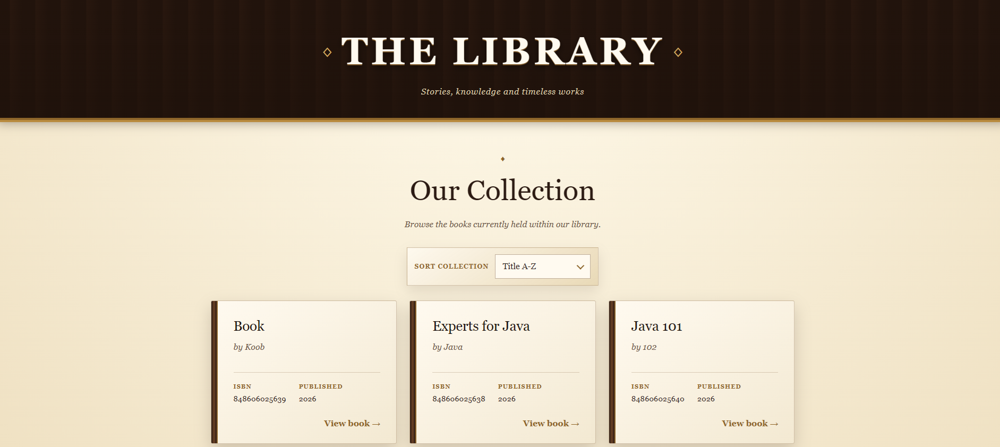
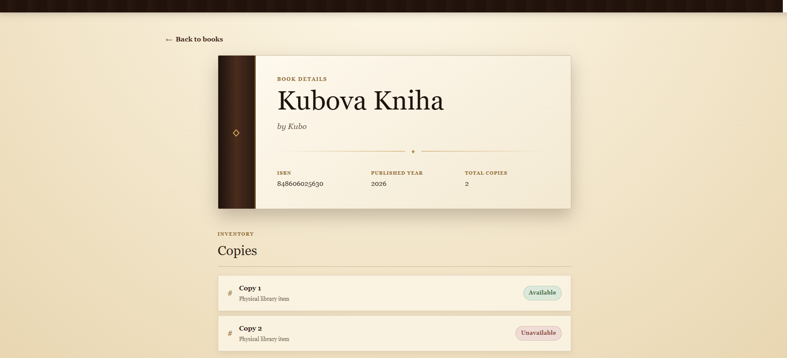
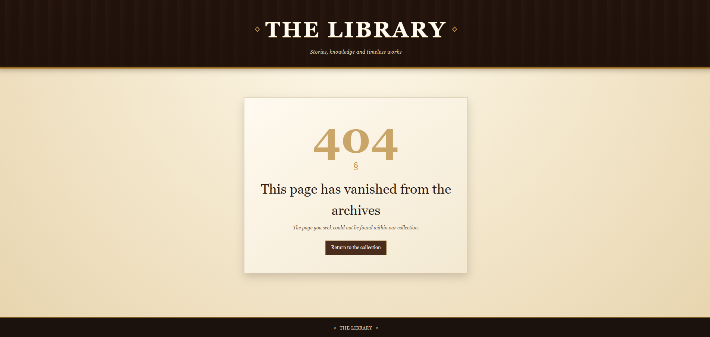

# Library Management System

Author: **Jakub Majer**

A Spring Boot library management assignment implementation for managing books and their physical copies. The project provides a REST API, Swagger documentation, PostgreSQL persistence, validation, structured error handling, tests, Docker support, and a small Thymeleaf frontend for browsing the collection.

## Quick Start

### Option 1: Run the database and app with Docker

Requirements:

- Docker
- Docker Compose

```powershell
docker compose up --build
```

The application will be available at:

- Frontend: `http://localhost:8080/books`
- Swagger UI: `http://localhost:8080/swagger-ui.html`
- OpenAPI JSON: `http://localhost:8080/v3/api-docs`

Stop the containers:

```powershell
docker compose down
```

Stop the containers and remove the persisted database volume:

```powershell
docker compose down -v
```

### Option 2: Run only PostgreSQL in Docker and run the app locally

Start PostgreSQL:

```powershell
docker compose up -d postgres
```

Run the Spring Boot application locally:

```powershell
.\mvnw.cmd spring-boot:run
```

On Linux/macOS:

```bash
./mvnw spring-boot:run
```

The local app uses these default database settings, which match `docker-compose.yml`:

```properties
spring.datasource.url=jdbc:postgresql://localhost:5432/library_db
spring.datasource.username=library_user
spring.datasource.password=library_password
```

## Tech Stack

- Java 21
- Spring Boot 4.1
- Spring Web MVC
- Spring Data JPA
- PostgreSQL 16
- Thymeleaf
- MapStruct
- Lombok
- Bean Validation
- Springdoc OpenAPI / Swagger UI
- Maven Wrapper
- Docker / Docker Compose
- JUnit, Mockito, MockMvc, Testcontainers

## Application Shape

This is intentionally a **modular monolith**.

For this assignment, splitting the system into separate services would add deployment, networking, transaction, and operational complexity without solving a real problem. The domain is small and cohesive: books, copies, validation, persistence, API, and frontend all belong naturally in one Spring Boot application.

The code is still separated by responsibility:

- Controllers expose REST endpoints and Thymeleaf pages.
- Services hold business logic and transaction boundaries.
- Repositories isolate database access.
- DTOs define API input/output contracts.
- Mappers convert between entities and DTOs.
- Exception handlers keep API errors and frontend errors consistent.
- Templates and static CSS provide the small frontend.

## Data Model

### Book

| Field | Type | Notes |
| --- | --- | --- |
| `id` | `Long` | Auto-generated primary key |
| `title` | `String` | Required, unique, max 255 characters |
| `author` | `String` | Required, max 255 characters |
| `isbn` | `String` | Required, unique, validated as ISBN-10 or ISBN-13-like format |
| `publishedYear` | `Integer` | Required, minimum `1000` |

### BookCopy

| Field | Type | Notes |
| --- | --- | --- |
| `id` | `Long` | Auto-generated primary key |
| `book` | `Book` | Required many-to-one relation |
| `available` | `Boolean` | Required, defaults to `true` |

### Database initialization

There is no seed data script. The application creates/updates the schema through Hibernate using:

```properties
spring.jpa.hibernate.ddl-auto=update
```

When running with Docker Compose, PostgreSQL data is stored in the `library-postgres-data` Docker volume. If you want a completely fresh database, run:

```powershell
docker compose down -v
```

## Creating Sample Data

Use Swagger UI or `curl.exe` from PowerShell.

Create a book:

```powershell
curl.exe -X POST http://localhost:8080/api/books `
  -H "Content-Type: application/json" `
  -d '{"title":"Clean Code","author":"Robert C. Martin","isbn":"978-0132350884","publishedYear":2008}'
```

Create another book:

```powershell
curl.exe -X POST http://localhost:8080/api/books `
  -H "Content-Type: application/json" `
  -d '{"title":"Effective Java","author":"Joshua Bloch","isbn":"978-0134685991","publishedYear":2018}'
```

Add a physical copy for book `1`:

```powershell
curl.exe -X POST http://localhost:8080/api/books/1/copies
```

Mark copy `1` as unavailable:

```powershell
curl.exe -X PATCH http://localhost:8080/api/books/1/copies/1 `
  -H "Content-Type: application/json" `
  -d '{"available":false}'
```

## REST API

Swagger UI is available at:

```text
http://localhost:8080/swagger-ui.html
```

### Books

| Method | Endpoint | Description |
| --- | --- | --- |
| `GET` | `/api/books` | Returns paginated books. Supports `page`, `size`, and `sort`. |
| `POST` | `/api/books` | Creates a new book. |
| `GET` | `/api/books/{id}` | Returns one book with its copies. |
| `PATCH` | `/api/books/{id}` | Partially updates a book. Only supplied fields are changed. |
| `DELETE` | `/api/books/{id}` | Deletes a book and its copies. |

### Book Copies

| Method | Endpoint | Description |
| --- | --- | --- |
| `GET` | `/api/books/{bookId}/copies` | Returns all copies for a book. |
| `POST` | `/api/books/{bookId}/copies` | Creates a new available copy for a book. |
| `PATCH` | `/api/books/{bookId}/copies/{copyId}` | Updates copy availability. |

### Pagination note

The assignment example shows `GET /api/books` returning a plain JSON array. This implementation uses Spring Data pagination as a bonus feature, so the response is a page object instead:

```json
{
  "content": [
    {
      "id": 1,
      "title": "Clean Code",
      "author": "Robert C. Martin",
      "isbn": "978-0132350884",
      "publishedYear": 2008
    }
  ],
  "pageable": {},
  "totalElements": 1,
  "totalPages": 1,
  "size": 10,
  "number": 0
}
```

Useful examples:

```text
GET /api/books?page=0&size=10&sort=title,asc
GET /api/books?page=1&size=5&sort=publishedYear,desc
```

The configured API maximum page size is `100`.

### PATCH instead of PUT

The assignment labels update operations as `PUT`, but describes partial updates where only included fields should change. This implementation uses `PATCH` because that matches the behavior more accurately.

## Frontend

The Thymeleaf frontend is intentionally small and uses the same backend services as the API.

| Route | Description |
| --- | --- |
| `/books` | Collection page with paginated book cards and sorting. |
| `/books/{id}` | Detail page showing book metadata and physical copies. |
| `/error/404` | Styled not-found page. |
| `/error/500` | Styled server-error page. |

The frontend list page is fixed to **9 books per page** so the card grid stays visually balanced. The URL can still contain `page` and `sort` query parameters because they are useful for bookmarking and sharing a filtered/sorted view. The frontend intentionally ignores user-provided `size` and enforces the page size server-side.

Frontend sorting options:

- `Title A-Z`
- `Title Z-A`
- `Author A-Z`
- `Newest first`
- `Oldest first`

### Screenshots

Add screenshots under `docs/screenshots/` using these names if you want the README images to render directly on GitHub:

```text
docs/screenshots/books-list.png
docs/screenshots/book-detail.png
docs/screenshots/not-found.png
```

Expected views:



The books list page shows the main collection, the centered sorting control, book cards, and pagination. It is the main browser entry point at `/books`.



The book detail page shows title, author, ISBN, published year, total copy count, and availability badges for each physical copy.



The 404 page is used for missing frontend resources such as `/books/99` when that book does not exist. CSS is loaded through absolute `/css/...` paths so nested URLs still render correctly.

## Validation and Error Handling

Validation is applied to request bodies and path variables:

- Book IDs and copy IDs must be positive.
- Book title and author are required when creating a book.
- ISBN is required and must match the accepted ISBN pattern.
- Published year is required when creating a book and must be at least `1000`.
- Availability updates require a non-null `available` value.

API errors return structured JSON responses with status, message, request path, timestamp, and field errors where applicable.

Frontend errors render Thymeleaf error pages:

- Missing frontend entity: `404`
- Unexpected frontend error: `500`

## Logging

Console logs use ECS-style structured JSON:

```properties
logging.structured.format.console=ecs
```

The services log important write operations, for example:

- Book created
- Book updated
- Book deleted
- Book copy added
- Book copy availability changed

The exception handlers log validation failures, not-found cases, conflicts, and unexpected errors at appropriate levels.

## Tests

Run the full test suite:

```powershell
.\mvnw.cmd test
```

On Linux/macOS:

```bash
./mvnw test
```

The suite covers controllers, services, validation, repository behavior, API integration paths, and the frontend 404 behavior.

## Useful Project URLs

After startup:

| URL | Purpose |
| --- | --- |
| `http://localhost:8080/books` | Thymeleaf frontend |
| `http://localhost:8080/api/books` | Books REST API |
| `http://localhost:8080/swagger-ui.html` | Swagger UI |
| `http://localhost:8080/v3/api-docs` | OpenAPI JSON |

## Notes for Reviewers

- The API implements the required book and copy management use cases.
- `GET /api/books` is paginated, so its response shape differs from the plain array shown in the assignment.
- Update endpoints use `PATCH` because the assignment describes partial update behavior.
- The system is a monolith by design because the assignment scope does not justify microservices.
